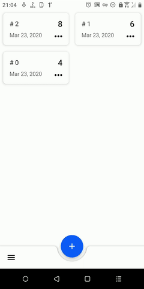
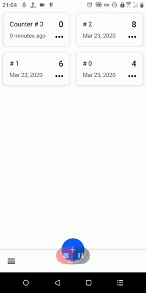
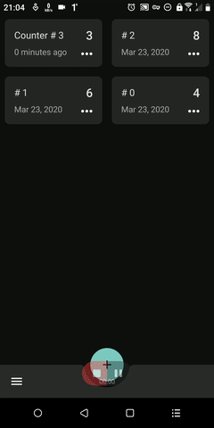

# Touch Counter

## Overview
Kotlin Android application to counter anything with retention time, storing and dark theme.

    
    
    

## Tech-stack

This simple app uses a lot of popular libraries. Most of the libraries are in the stable version, unless there is a good reason to use non-stable dependency.

### Dependencies

-   [Jetpack](https://developer.android.com/jetpack):
    -   [Android KTX](https://developer.android.com/kotlin/ktx.html) - provide concise, idiomatic Kotlin to Jetpack and Android platform APIs.
    -   [AndroidX](https://developer.android.com/jetpack/androidx) - major improvement to the original Android [Support Library](https://developer.android.com/topic/libraries/support-library/index), which is no longer maintained.
    -   [View Binding](https://developer.android.com/topic/libraries/view-binding) - allows you to more easily write code that interacts with views.
    -   [Lifecycle](https://developer.android.com/topic/libraries/architecture/lifecycle) - perform actions in response to a change in the lifecycle status of another component, such as activities and fragments.
    -   [LiveData](https://developer.android.com/topic/libraries/architecture/livedata) - lifecycle-aware, meaning it respects the lifecycle of other app components, such as activities, fragments, or services.
    -   [Room](https://developer.android.com/topic/libraries/architecture/room) - persistence library provides an abstraction layer over SQLite to allow for more robust database access while harnessing the full power of SQLite.
    -   [ViewModel](https://developer.android.com/topic/libraries/architecture/viewmodel) - designed to store and manage UI-related data in a lifecycle conscious way. The ViewModel class allows data to survive configuration changes such as screen rotations.
-   [Coroutines](https://kotlinlang.org/docs/reference/coroutines-overview.html) - managing background threads with simplified code and reducing needs for callbacks.
-   [Dagger2](https://dagger.dev/) - dependency injector for replacement all FactoryFactory classes.
-   [Material Design](https://material.io/) - material design components for Android.
-   [Timber](https://github.com/JakeWharton/timber) - a logger with a small, extensible API which provides utility on top of Android's normal Log class.
-   [and more...](./dependencies/dependencies.gradle)

### Test dependencies

-   [Robolectric](https://github.com/robolectric/robolectric) - industry-standard unit testing framework for Android.
-   [JUnit](https://github.com/junit-team/junit4) - a simple framework to write repeatable tests. It is an instance of the xUnit architecture for unit testing frameworks.
-   [Mockito](https://github.com/nhaarman/mockito-kotlin) - most popular Mocking framework for unit tests written in Java.
-   [Mockk](https://github.com/mockk/mockk) - provides DSL to mock behavior. Built from zero to fit Kotlin language.
-   [TestObserver](https://github.com/jraska/livedata-testing) - special observer which helps to easily test LiveData and make assertions on them.
-   [AndroidX](https://github.com/android/android-test) - the androidx test library provides an extensive framework for testing Android apps.
-   [and more...](./dependencies/testing_dependencies.gradle)

### Plugins

-   [Ktlint](https://github.com/pinterest/ktlint) - an anti-bikeshedding Kotlin linter with built-in formatter.
